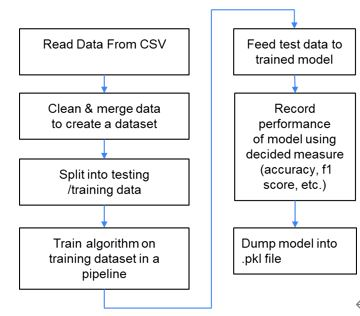

# Python-CapstoneProject-ML

# Introduction 
The client provides operational, engineering, and customer support for the aircraft industry. In this project, the purpose is to use algorithms to classify ATA codes by the text written by the aircraft technicians.

# Scope
The scope of this project is to build a machine learning or deep learning model to achieve the best accuracy of predicting a suitable ATA_SYMPTOM and ATA_CAUSE for given Interruption Reason and Correction Action.

# Architecture
The workflow of this project is as follows 

# Method
For the text preprocessing, the words are tokenized and stemmed and the stop words are removed. The next step is to use the transformer method to convert the text into a number. In this project, TFIDF(term frequency-inverse document frequency) was applied to give each word a score according to how common and relevant e a word is in the entire document.

For the algorithms, this project has fed the data to several machine learning algorithms, and a deep learning algorithm to identify which algorithm performs better. In this project, we focus on improving the accuracy rate using LinearSVC(Linear Support Vector Classification) and TextCNN(Text Convolutional Neural Network). 

# Result

The experiment was done by splitting 11 years of the dataset (AI+FI) into training and testing datasets. The input text data was Interruption reason and corrective action, and the ouyput data is a ATA code. The final average accuracy rate of the LinearSVC is 73.4% while the final average accuracy rate of TexrCNN is 65.5%.

# Conclusion

According to this project’s finding, the machine learning model performs better than the deep learning model to the AI/FI dataset. However, there are still several deep learning models, and parameter settings that can be applied to improve the overall accuracy rate.

